# Z-Index Stacking Order — Chi tiết Selectors

> **Scope:** `~/Project/aemaacs-investments-BE/aemaacs-investments/mandg-investments/ui.frontend/src/main/webpack/scss`

> [!NOTE]
> Sắp xếp từ **CAO → THẤP**. Mỗi selector ghi rõ file, dòng, và ngữ cảnh sử dụng.

---

## Token Reference

| Token | Giá trị | Mô tả |
|---|---|---|
| `$base-z-index-overlay-fullscreen` | **10000** | Fullscreen overlays |
| `$base-z-index-ui-skip-to-main-link` | **9999** | Skip to main content link |
| `$base-z-index-ui-back-to-top` | **1000** | Back to top button |
| `$base-z-index-overlay-modal` | **1000** | Modal dialogs |
| `$base-z-index-ui-popover` | **900** | Popover elements |
| `$base-z-index-ui-tooltip` | **800** | Tooltip elements |
| `$base-z-index-ui-navigation` | **700** | Main navigation |
| `$base-z-index-ui-header` | **600** | Site header |
| `$base-z-index-ui-sidebar` | **500** | Sidebar navigation |
| `$base-z-index-ui-overlay-backdrop` | **400** | Overlay backdrop |
| `$base-z-index-ui-fixed` | **300** | Fixed positioned elements |
| `$base-z-index-ui-floating` | **250** | Floating UI elements |
| `$base-z-index-ui-sticky` | **200** | Sticky positioned elements |
| `$base-z-index-ui-dropdown` | **100** | Dropdown elements |
| `$base-z-index-content-elevated` | **10** | Elevated content |
| `$base-z-index-content-level-3` | **3** | Content layer level 3 |
| `$base-z-index-content-level-2` | **2** | Content layer level 2 |
| `$base-z-index-content-level-1` | **1** | Content layer level 1 |
| `$base-z-index-base-base` | **0** | Base z-index level |
| `$base-z-index-base-behind` | **−1** | Behind other elements |
| `$base-z-index-base-background` | **−10** | Background layer |

Định nghĩa tại: [_tokens.scss](file:///Users/tri.nguyen/Project/aemaacs-investments-BE/aemaacs-investments/mandg-investments/ui.frontend/src/main/webpack/scss/base/1-settings/_tokens.scss#L227-L247)

---

## 🔴 z: 10000 — `$base-z-index-overlay-fullscreen`

| # | Selector | Ngữ cảnh | File |
|---|---|---|---|
| 1 | `.search-results-tabs-container` | Mobile fullscreen filter panel (`position: fixed; inset: 0`) — chỉ active trên `breakpoint-down(md)` | [_search-results.scss:112](file:///Users/tri.nguyen/Project/aemaacs-investments-BE/aemaacs-investments/mandg-investments/ui.frontend/src/main/webpack/scss/base/6-components/search-results/_search-results.scss#L112) |

---

## 🔴 z: 9999 — `$base-z-index-ui-skip-to-main-link`

| # | Selector | Ngữ cảnh | File |
|---|---|---|---|
| 1 | `.header-top` | Top header bar (chứa language selector, audience links) — `position: relative` | [_top-header.scss:15](file:///Users/tri.nguyen/Project/aemaacs-investments-BE/aemaacs-investments/mandg-investments/ui.frontend/src/main/webpack/scss/base/6-components/mega-menu/top-header/_top-header.scss#L15) |
| 2 | `.header-menu-button` | Nút CTA trong menu mobile (nằm `position: absolute; bottom: 0` trong menu panel) | [_header-menu.scss:61](file:///Users/tri.nguyen/Project/aemaacs-investments-BE/aemaacs-investments/mandg-investments/ui.frontend/src/main/webpack/scss/base/6-components/mega-menu/_header-menu.scss#L61) |
| 3 | `.filter__form-toggle-button[aria-expanded='true']` | Nút toggle filter trên mobile khi mở — `position: fixed; top: 0` | [_filter-form-item.scss:384](file:///Users/tri.nguyen/Project/aemaacs-investments-BE/aemaacs-investments/mandg-investments/ui.frontend/src/main/webpack/scss/base/7-utilities/filter-form-item/_filter-form-item.scss#L384) |
| 4 | `.skip-to-main-link` | Accessibility skip link — `position: absolute; top: 0` | [_skip-to-main-link.scss:9](file:///Users/tri.nguyen/Project/aemaacs-investments-BE/aemaacs-investments/mandg-investments/ui.frontend/src/main/webpack/scss/base/7-utilities/skip-to-main-link/_skip-to-main-link.scss#L9) |
| 5 | `html:has(.attestation--landing-page-onetrust) #onetrust-consent-sdk` | Cookie consent SDK trên attestation landing page — `position: relative` | [_cookie-banner.scss:54](file:///Users/tri.nguyen/Project/aemaacs-investments-BE/aemaacs-investments/mandg-investments/ui.frontend/src/main/webpack/scss/base/7-utilities/_cookie-banner.scss#L54) |

---

## 🟡 z: 1000 — `$base-z-index-overlay-modal` + `$base-z-index-ui-back-to-top`

> [!WARNING]
> Hai token khác nhau, **CÙNG giá trị 1000** — có thể gây chồng chéo giữa modal và banner.

### Token: `overlay-modal` (1000)

| # | Selector | Ngữ cảnh | File |
|---|---|---|---|
| 1 | `.popup`, `.popup-static` | Popup/modal wrapper — `position: fixed; inset: 0` | [_popup.scss:132](file:///Users/tri.nguyen/Project/aemaacs-investments-BE/aemaacs-investments/mandg-investments/ui.frontend/src/main/webpack/scss/base/3-generics/_popup.scss#L132) |
| 2 | `.main-menu-dropdown` | Mega menu dropdown panel — `position: absolute` | [_nav-item.scss:11](file:///Users/tri.nguyen/Project/aemaacs-investments-BE/aemaacs-investments/mandg-investments/ui.frontend/src/main/webpack/scss/base/6-components/mega-menu/nav-item/_nav-item.scss#L11) |
| 3 | `.attestation-close-button` | Nút đóng attestation — `position: absolute; top: -20px; right: -20px` | [_attestation.scss:128](file:///Users/tri.nguyen/Project/aemaacs-investments-BE/aemaacs-investments/mandg-investments/ui.frontend/src/main/webpack/scss/base/6-components/attestation/_attestation.scss#L128) |
| 4 | `.attestation-dropdown-wrapper` | Dropdown overlay trong attestation form — `position: absolute; top: calc(100% + spacing)` | [_attestation.scss:405](file:///Users/tri.nguyen/Project/aemaacs-investments-BE/aemaacs-investments/mandg-investments/ui.frontend/src/main/webpack/scss/base/6-components/attestation/_attestation.scss#L405) |

### Token: `ui-back-to-top` (1000)

| # | Selector | Ngữ cảnh | File |
|---|---|---|---|
| 1 | `.header-fixed` | Fixed header container — `position: fixed; top: 0; left: 0; right: 0` | [_header-base.scss:33](file:///Users/tri.nguyen/Project/aemaacs-investments-BE/aemaacs-investments/mandg-investments/ui.frontend/src/main/webpack/scss/base/6-components/mega-menu/_header-base.scss#L33) |
| 2 | `.back-to-top-wrapper` | Back-to-top button wrapper — `position: fixed; bottom: spacing` | [_back-to-top.scss:38](file:///Users/tri.nguyen/Project/aemaacs-investments-BE/aemaacs-investments/mandg-investments/ui.frontend/src/main/webpack/scss/base/7-utilities/back-to-top/_back-to-top.scss#L38) |
| 3 | `.dismissible-service-banner-v2:has(~ .header-fixed)` | Dismissible banner dính trên đầu trang — `position: fixed; top: 0; width: 100%` | [_dismissible-service-banner.scss:33](file:///Users/tri.nguyen/Project/aemaacs-investments-BE/aemaacs-investments/mandg-investments/ui.frontend/src/main/webpack/scss/base/6-components/dismissible-service-banner/_dismissible-service-banner.scss#L33) |
| 4 | `.text-error-message:has(~ .header-fixed)` | Error message banner — `position: absolute; top: 0; width: 100%` | [_text-error-message.scss:15](file:///Users/tri.nguyen/Project/aemaacs-investments-BE/aemaacs-investments/mandg-investments/ui.frontend/src/main/webpack/scss/base/6-components/text/_text-error-message.scss#L15) |
| 5 | `.filter__form` (mobile `breakpoint-down(lg)`) | Filter form mobile overlay — `position: fixed; inset: 0` | [_filter-form-item.scss:502](file:///Users/tri.nguyen/Project/aemaacs-investments-BE/aemaacs-investments/mandg-investments/ui.frontend/src/main/webpack/scss/base/7-utilities/filter-form-item/_filter-form-item.scss#L502) |

---

## 🟠 z: 900 — `$base-z-index-ui-popover`

| # | Selector | Ngữ cảnh | File |
|---|---|---|---|
| 1 | `#onetrust-pc-sdk .ot-title-cntr`, `#onetrust-pc-sdk .pc-header` | Cookie preference center header — `position: absolute` | [_cookie-banner.scss:181](file:///Users/tri.nguyen/Project/aemaacs-investments-BE/aemaacs-investments/mandg-investments/ui.frontend/src/main/webpack/scss/base/7-utilities/_cookie-banner.scss#L181) |
| 2 | `.fcc-toggle-section` | Fund charge calculator toggle panel — `position: fixed` | [_toggle-section.scss:9](file:///Users/tri.nguyen/Project/aemaacs-investments-BE/aemaacs-investments/mandg-investments/ui.frontend/src/main/webpack/scss/base/6-components/fund-charge-calculator/components/_toggle-section.scss#L9) |

---

## 🟠 z: 700 — `$base-z-index-ui-navigation`

| # | Selector | Ngữ cảnh | File |
|---|---|---|---|
| 1 | `.header-menu` (mobile `breakpoint-down(md)`) | Mobile main navigation — `position: fixed; inset: header-height 0 0 0` | [_header-menu.scss:20](file:///Users/tri.nguyen/Project/aemaacs-investments-BE/aemaacs-investments/mandg-investments/ui.frontend/src/main/webpack/scss/base/6-components/mega-menu/_header-menu.scss#L20) |

---

## 🟠 z: 600 — `$base-z-index-ui-header`

| # | Selector | Ngữ cảnh | File |
|---|---|---|---|
| 1 | `.marketing-label` | Marketing communication label — `position: fixed; right: 0` | [_marketing-communication.scss:22](file:///Users/tri.nguyen/Project/aemaacs-investments-BE/aemaacs-investments/mandg-investments/ui.frontend/src/main/webpack/scss/base/6-components/marketing-communication/_marketing-communication.scss#L22) |

---

## 🟠 z: 500 — `$base-z-index-ui-sidebar`

| # | Selector | Ngữ cảnh | File |
|---|---|---|---|
| 1 | `.article-header:not(&--by-author-only) .article-header__inner` | Article header inner content — `position: relative`, nằm trên background image | [_article-header.scss:120](file:///Users/tri.nguyen/Project/aemaacs-investments-BE/aemaacs-investments/mandg-investments/ui.frontend/src/main/webpack/scss/base/6-components/article-header/_article-header.scss#L120) |
| 2 | `.article-header__social-share .social-share__wrapper` (desktop `breakpoint-up(md)`) | Social share fixed wrapper — `position: fixed; top: header + offset` | [_article-header.scss:225](file:///Users/tri.nguyen/Project/aemaacs-investments-BE/aemaacs-investments/mandg-investments/ui.frontend/src/main/webpack/scss/base/6-components/article-header/_article-header.scss#L225) |
| 3 | `.fcc-field--high-index` | Fund charge calculator field elevated state | [_field.scss:96](file:///Users/tri.nguyen/Project/aemaacs-investments-BE/aemaacs-investments/mandg-investments/ui.frontend/src/main/webpack/scss/base/6-components/fund-charge-calculator/components/_field.scss#L96) |

---

## 🟡 z: 400 — `$base-z-index-ui-overlay-backdrop`

| # | Selector | Ngữ cảnh | File |
|---|---|---|---|
| 1 | `.cmp-breadcrumb` | Breadcrumb — `position: absolute; top: calc(header-height + spacing)` | [_breadcrumb.scss:12](file:///Users/tri.nguyen/Project/aemaacs-investments-BE/aemaacs-investments/mandg-investments/ui.frontend/src/main/webpack/scss/base/6-components/breadcrumb/_breadcrumb.scss#L12) |
| 2 | `.fcc-toggle-section__overlay` | Fund charge calculator backdrop — `position: fixed; inset: 0` | [_toggle-section.scss:89](file:///Users/tri.nguyen/Project/aemaacs-investments-BE/aemaacs-investments/mandg-investments/ui.frontend/src/main/webpack/scss/base/6-components/fund-charge-calculator/components/_toggle-section.scss#L89) |
| 3 | `.navigation--type-fund-page` | Fund page sticky navigation — `position: sticky; top: header-height` | [_navigation-fund-page.scss:13](file:///Users/tri.nguyen/Project/aemaacs-investments-BE/aemaacs-investments/mandg-investments/ui.frontend/src/main/webpack/scss/base/6-components/navigation/_navigation-fund-page.scss#L13) |

---

## 🟢 z: 300 — `$base-z-index-ui-fixed`

| # | Selector | Ngữ cảnh | File |
|---|---|---|---|
| 1 | `.social-share__inner` (desktop `breakpoint-up(md)`) | Social share expanded items — `position: absolute; top: 100%` | [_social-share.scss:59](file:///Users/tri.nguyen/Project/aemaacs-investments-BE/aemaacs-investments/mandg-investments/ui.frontend/src/main/webpack/scss/base/6-components/social-share/_social-share.scss#L59) |
| 2 | `.in-page-navigation--top .in-page-nav__sticky-nav.is-sticky` | In-page nav sticky bar — `position: sticky; top: var(--sticky-top-offset)` | [_in-page-navigation-top.scss:135](file:///Users/tri.nguyen/Project/aemaacs-investments-BE/aemaacs-investments/mandg-investments/ui.frontend/src/main/webpack/scss/base/6-components/in-page-navigation/_in-page-navigation-top.scss#L135) |

---

## 🟢 z: 250 — `$base-z-index-ui-floating`

| # | Selector | Ngữ cảnh | File |
|---|---|---|---|
| 1 | `.search-category-filter-list` | Filter dropdown list — `position: absolute; top: 100%` | [_filter-form-item.scss:249](file:///Users/tri.nguyen/Project/aemaacs-investments-BE/aemaacs-investments/mandg-investments/ui.frontend/src/main/webpack/scss/base/7-utilities/filter-form-item/_filter-form-item.scss#L249) |

---

## 🟢 z: 200 — `$base-z-index-ui-sticky`

| # | Selector | Ngữ cảnh | File |
|---|---|---|---|
| 1 | `.cmp-experiencefragment .container--sticky` | Sticky container (experience fragment) — `position: fixed; top: 0; left: 0; right: 0` | [_container-pin-top.scss:12](file:///Users/tri.nguyen/Project/aemaacs-investments-BE/aemaacs-investments/mandg-investments/ui.frontend/src/main/webpack/scss/base/6-components/container/_container-pin-top.scss#L12) |
| 2 | `.article-header__progress-bar` | Article reading progress bar — `position: sticky; top: header-height` | [_article-header.scss:258](file:///Users/tri.nguyen/Project/aemaacs-investments-BE/aemaacs-investments/mandg-investments/ui.frontend/src/main/webpack/scss/base/6-components/article-header/_article-header.scss#L258) |
| 3 | `.printbutton:has(.print-button-cmp__inner--float-right-bottom)` | Floating print button — `position: sticky; bottom: 0` | [_print-button.scss:57](file:///Users/tri.nguyen/Project/aemaacs-investments-BE/aemaacs-investments/mandg-investments/ui.frontend/src/main/webpack/scss/base/6-components/print-button/_print-button.scss#L57) |

---

## 🔵 z: 100 — `$base-z-index-ui-dropdown`

| # | Selector | Ngữ cảnh | File |
|---|---|---|---|
| 1 | `.header-audience .header-attestation` | Attestation modal triggered từ header audience — `position: fixed; inset: 0` | [_header-audience.scss:16](file:///Users/tri.nguyen/Project/aemaacs-investments-BE/aemaacs-investments/mandg-investments/ui.frontend/src/main/webpack/scss/base/6-components/mega-menu/_header-audience.scss#L16) |
| 2 | `.header-dropdown__wrapper` | Header dropdown panel — `position: absolute; top: calc(100% + 2px)` | [_top-header-dropdown.scss:94](file:///Users/tri.nguyen/Project/aemaacs-investments-BE/aemaacs-investments/mandg-investments/ui.frontend/src/main/webpack/scss/base/6-components/mega-menu/top-header/_top-header-dropdown.scss#L94) |
| 3 | `.suggestions-container` | Search suggestions dropdown — `position: absolute; top: calc(100% + spacing)` | [_search-box.scss:232](file:///Users/tri.nguyen/Project/aemaacs-investments-BE/aemaacs-investments/mandg-investments/ui.frontend/src/main/webpack/scss/base/6-components/search-box/_search-box.scss#L232) |
| 4 | `.social-share__items--pinned` | Pinned social share icons — `position: sticky; top: calc(...)` | [_social-share.scss:81](file:///Users/tri.nguyen/Project/aemaacs-investments-BE/aemaacs-investments/mandg-investments/ui.frontend/src/main/webpack/scss/base/6-components/social-share/_social-share.scss#L81) |
| 5 | `.fcc-toggle-section__button` | Fund charge calculator toggle button | [_toggle-section.scss:119](file:///Users/tri.nguyen/Project/aemaacs-investments-BE/aemaacs-investments/mandg-investments/ui.frontend/src/main/webpack/scss/base/6-components/fund-charge-calculator/components/_toggle-section.scss#L119) |

---

## 🔵 z: 10 — `$base-z-index-content-elevated`

| # | Selector | Ngữ cảnh | File |
|---|---|---|---|
| 1 | `.popup-inner` | Popup inner content — `position: relative` | [_popup.scss:93](file:///Users/tri.nguyen/Project/aemaacs-investments-BE/aemaacs-investments/mandg-investments/ui.frontend/src/main/webpack/scss/base/3-generics/_popup.scss#L93) |
| 2 | `.container--sticky` (desktop `breakpoint-up(md)`) | Sticky container within page — `position: sticky; top: sticky-top-offset` | [_container.scss:48](file:///Users/tri.nguyen/Project/aemaacs-investments-BE/aemaacs-investments/mandg-investments/ui.frontend/src/main/webpack/scss/base/6-components/container/_container.scss#L48) |
| 3 | `.table thead th` (fixed header) | Sticky table header cell — `position: sticky; top: 0` | [_table-base.scss:26](file:///Users/tri.nguyen/Project/aemaacs-investments-BE/aemaacs-investments/mandg-investments/ui.frontend/src/main/webpack/scss/base/6-components/table/_table-base.scss#L26) |
| 4 | `.table tfoot td` | Table footer cell — `position: sticky; bottom: 0` | [_table-base.scss:50](file:///Users/tri.nguyen/Project/aemaacs-investments-BE/aemaacs-investments/mandg-investments/ui.frontend/src/main/webpack/scss/base/6-components/table/_table-base.scss#L50) |
| 5 | `.advance-table .advance-sorting-column__dropdown` | Advance table sorting dropdown | [_advance-sorting-column.scss:110](file:///Users/tri.nguyen/Project/aemaacs-investments-BE/aemaacs-investments/mandg-investments/ui.frontend/src/main/webpack/scss/base/6-components/table/advance-table/_advance-sorting-column.scss#L110) |
| 6 | `@include mixins.popup(...)` default `$z-index` parameter | Mixin popup — mặc định sử dụng `overlay-modal`, nhưng có thể override | [_mixins.scss:171](file:///Users/tri.nguyen/Project/aemaacs-investments-BE/aemaacs-investments/mandg-investments/ui.frontend/src/main/webpack/scss/base/2-tools/_mixins.scss#L171) |
| 7 | `.relatedcontent .relatedcontent__navigation-button--gradient:after` | Related content nav gradient overlay | [_related-content.scss:278](file:///Users/tri.nguyen/Project/aemaacs-investments-BE/aemaacs-investments/mandg-investments/ui.frontend/src/main/webpack/scss/base/6-components/related-content/_related-content.scss#L278) |
| 8 | `.in-page-nav__sticky-nav--moved` | In-page nav moved state — `width: 100%` | [_in-page-navigation-top.scss:263](file:///Users/tri.nguyen/Project/aemaacs-investments-BE/aemaacs-investments/mandg-investments/ui.frontend/src/main/webpack/scss/base/6-components/in-page-navigation/_in-page-navigation-top.scss#L263) |
| 9 | `.fcc-toggle-section__content-arrow` | Fund charge calculator tooltip arrow — `position: absolute` | [_toggle-section.scss:141](file:///Users/tri.nguyen/Project/aemaacs-investments-BE/aemaacs-investments/mandg-investments/ui.frontend/src/main/webpack/scss/base/6-components/fund-charge-calculator/components/_toggle-section.scss#L141) |
| 10 | `.fcc-field__label` | Fund charge calculator field label — `position: absolute` | [_field.scss:26](file:///Users/tri.nguyen/Project/aemaacs-investments-BE/aemaacs-investments/mandg-investments/ui.frontend/src/main/webpack/scss/base/6-components/fund-charge-calculator/components/_field.scss#L26) |

---

## 🔵 z: 3 — `$base-z-index-content-level-3`

| # | Selector | Ngữ cảnh | File |
|---|---|---|---|
| 1 | `.swiper-nav__navigation` | Swiper navigation arrows | [_swiper.scss:17](file:///Users/tri.nguyen/Project/aemaacs-investments-BE/aemaacs-investments/mandg-investments/ui.frontend/src/main/webpack/scss/base/3-generics/swiper/_swiper.scss#L17) |
| 2 | `.popup-is-close` | Popup close button — `position: absolute` | [_popup.scss:151](file:///Users/tri.nguyen/Project/aemaacs-investments-BE/aemaacs-investments/mandg-investments/ui.frontend/src/main/webpack/scss/base/3-generics/_popup.scss#L151) |
| 3 | `.content-tile--with-video .content-tile__video-container` | Content tile video play overlay | [_content-tile-with-video.scss:15](file:///Users/tri.nguyen/Project/aemaacs-investments-BE/aemaacs-investments/mandg-investments/ui.frontend/src/main/webpack/scss/base/6-components/content-tile/_content-tile-with-video.scss#L15) |
| 4 | `.relatedcontent__slider-container` | Related content slider wrapper | [_related-content.scss:259](file:///Users/tri.nguyen/Project/aemaacs-investments-BE/aemaacs-investments/mandg-investments/ui.frontend/src/main/webpack/scss/base/6-components/related-content/_related-content.scss#L259) |
| 5 | `.advance-sorting-column__button.active .advance-sorting-column__icon` | Active sorting icon trong advance table | [_advance-sorting-column.scss:70](file:///Users/tri.nguyen/Project/aemaacs-investments-BE/aemaacs-investments/mandg-investments/ui.frontend/src/main/webpack/scss/base/6-components/table/advance-table/_advance-sorting-column.scss#L70) |
| 6 | `.advance-table thead tr:first-child th` | Advance table first row header (sticky) | [_advance-fixed-first-row-column.scss:42](file:///Users/tri.nguyen/Project/aemaacs-investments-BE/aemaacs-investments/mandg-investments/ui.frontend/src/main/webpack/scss/base/6-components/table/advance-table/_advance-fixed-first-row-column.scss#L42) |
| 7 | `.advance-scroll-bar__wrapper` | Advance table scroll bar wrapper | [_advance-scroll-bar.scss:34](file:///Users/tri.nguyen/Project/aemaacs-investments-BE/aemaacs-investments/mandg-investments/ui.frontend/src/main/webpack/scss/base/6-components/table/advance-table/_advance-scroll-bar.scss#L34) |
| 8 | `.tabs--issue .tablist__dropdown-trigger--expanded .tablist__dropdown-content` | Tabs issue variant expanded dropdown | [_tabs-issue-variants.scss:238](file:///Users/tri.nguyen/Project/aemaacs-investments-BE/aemaacs-investments/mandg-investments/ui.frontend/src/main/webpack/scss/base/6-components/tabs/_tabs-issue-variants.scss#L238) |
| 9 | `.tabs--issue .tablist__dropdown-show` | Tab dropdown visible state | [_tabs-issue-variants.scss:285](file:///Users/tri.nguyen/Project/aemaacs-investments-BE/aemaacs-investments/mandg-investments/ui.frontend/src/main/webpack/scss/base/6-components/tabs/_tabs-issue-variants.scss#L285) |
| 10 | `.slider:before` | Slider full-width overlay — `position: absolute` | [_slider.scss:27](file:///Users/tri.nguyen/Project/aemaacs-investments-BE/aemaacs-investments/mandg-investments/ui.frontend/src/main/webpack/scss/base/6-components/slider/_slider.scss#L27) |
| 11 | `.in-page-nav__sticky-nav.is-sticky` (left variant) | In-page nav left sticky state | [_in-page-navigation.scss:71](file:///Users/tri.nguyen/Project/aemaacs-investments-BE/aemaacs-investments/mandg-investments/ui.frontend/src/main/webpack/scss/base/6-components/in-page-navigation/_in-page-navigation.scss#L71) |

---

## 🔵 z: 2 — `$base-z-index-content-level-2`

| # | Selector | Ngữ cảnh | File |
|---|---|---|---|
| 1 | `.popup-content` | Popup content wrapper | [_popup.scss:72](file:///Users/tri.nguyen/Project/aemaacs-investments-BE/aemaacs-investments/mandg-investments/ui.frontend/src/main/webpack/scss/base/3-generics/_popup.scss#L72) |
| 2 | `.content-tile__link` | Content tile full-area link overlay | [_content-tile.scss:55](file:///Users/tri.nguyen/Project/aemaacs-investments-BE/aemaacs-investments/mandg-investments/ui.frontend/src/main/webpack/scss/base/6-components/content-tile/_content-tile.scss#L55) |
| 3 | `.root > .aem-Grid > .container` | Root level container — giữ content trên background | [_container.scss:230](file:///Users/tri.nguyen/Project/aemaacs-investments-BE/aemaacs-investments/mandg-investments/ui.frontend/src/main/webpack/scss/base/6-components/container/_container.scss#L230) |
| 4 | `.glossary-filters__dropdown`, `.glossary-filters__search` | Glossary filter controls | [_glossary-filters.scss:109](file:///Users/tri.nguyen/Project/aemaacs-investments-BE/aemaacs-investments/mandg-investments/ui.frontend/src/main/webpack/scss/base/6-components/glossary/_glossary-filters.scss#L109), [:115](file:///Users/tri.nguyen/Project/aemaacs-investments-BE/aemaacs-investments/mandg-investments/ui.frontend/src/main/webpack/scss/base/6-components/glossary/_glossary-filters.scss#L115) |
| 5 | `.hero-banner-with-tiles__content` | Hero banner tiles content | [_hero-banner-with-tiles.scss:90](file:///Users/tri.nguyen/Project/aemaacs-investments-BE/aemaacs-investments/mandg-investments/ui.frontend/src/main/webpack/scss/base/6-components/hero-banner-with-tiles/_hero-banner-with-tiles.scss#L90) |
| 6 | `.hero-banner-with-tiles__tiles-wrapper` | Tiles wrapper container | [_hero-banner-with-tiles.scss:180](file:///Users/tri.nguyen/Project/aemaacs-investments-BE/aemaacs-investments/mandg-investments/ui.frontend/src/main/webpack/scss/base/6-components/hero-banner-with-tiles/_hero-banner-with-tiles.scss#L180) |
| 7 | `.hero-banner-with-tiles .image` | Tile image | [_hero-banner-with-tiles.scss:315](file:///Users/tri.nguyen/Project/aemaacs-investments-BE/aemaacs-investments/mandg-investments/ui.frontend/src/main/webpack/scss/base/6-components/hero-banner-with-tiles/_hero-banner-with-tiles.scss#L315) |
| 8 | `.hero-banner-with-tiles__tile-content` | Tile content area | [_hero-banner-with-tiles.scss:333](file:///Users/tri.nguyen/Project/aemaacs-investments-BE/aemaacs-investments/mandg-investments/ui.frontend/src/main/webpack/scss/base/6-components/hero-banner-with-tiles/_hero-banner-with-tiles.scss#L333) |
| 9 | `.hero-banner-with-tiles__tile-link-wrapper` | Tile link wrapper | [_hero-banner-with-tiles.scss:380](file:///Users/tri.nguyen/Project/aemaacs-investments-BE/aemaacs-investments/mandg-investments/ui.frontend/src/main/webpack/scss/base/6-components/hero-banner-with-tiles/_hero-banner-with-tiles.scss#L380) |
| 10 | `.icon-tile__content:after` | Icon tile hover overlay | [_icon-tile.scss:88](file:///Users/tri.nguyen/Project/aemaacs-investments-BE/aemaacs-investments/mandg-investments/ui.frontend/src/main/webpack/scss/base/6-components/icon-tile/_icon-tile.scss#L88) |
| 11 | `.insight-results` | Category search results — `position: relative` | [_insight-results.scss:11](file:///Users/tri.nguyen/Project/aemaacs-investments-BE/aemaacs-investments/mandg-investments/ui.frontend/src/main/webpack/scss/base/6-components/category-search/_insight-results.scss#L11) |
| 12 | `.navigation--type-fund-page` arrow button | Fund page nav arrow | [_navigation-fund-page.scss:97](file:///Users/tri.nguyen/Project/aemaacs-investments-BE/aemaacs-investments/mandg-investments/ui.frontend/src/main/webpack/scss/base/6-components/navigation/_navigation-fund-page.scss#L97) |
| 13 | `.navigation--type-fund-page` arrow `span` | Fund page nav arrow icon | [_navigation-fund-page.scss:104](file:///Users/tri.nguyen/Project/aemaacs-investments-BE/aemaacs-investments/mandg-investments/ui.frontend/src/main/webpack/scss/base/6-components/navigation/_navigation-fund-page.scss#L104) |
| 14 | `.relatedcontent .relatedcontent__heading-container` | Related content heading | [_related-content.scss:357](file:///Users/tri.nguyen/Project/aemaacs-investments-BE/aemaacs-investments/mandg-investments/ui.frontend/src/main/webpack/scss/base/6-components/related-content/_related-content.scss#L357) |
| 15 | `.search-results__item--image-thumbnail .search-results__link` | Search result item link overlay | [_search-results-items.scss:122](file:///Users/tri.nguyen/Project/aemaacs-investments-BE/aemaacs-investments/mandg-investments/ui.frontend/src/main/webpack/scss/base/6-components/search-results/_search-results-items.scss#L122) |
| 16 | `.slider-images:before` | Slider images gradient overlay — `position: absolute` | [_slider-images.scss:25](file:///Users/tri.nguyen/Project/aemaacs-investments-BE/aemaacs-investments/mandg-investments/ui.frontend/src/main/webpack/scss/base/6-components/slider/_slider-images.scss#L25) |
| 17 | `.fcc-dropdown__content` | Fund charge calculator dropdown content — `position: relative` | [_dropdown.scss:12](file:///Users/tri.nguyen/Project/aemaacs-investments-BE/aemaacs-investments/mandg-investments/ui.frontend/src/main/webpack/scss/base/6-components/fund-charge-calculator/components/_dropdown.scss#L12) |
| 18 | `.fcc-input__label` (focus state) | Fund charge calculator input label | [_input.scss:83](file:///Users/tri.nguyen/Project/aemaacs-investments-BE/aemaacs-investments/mandg-investments/ui.frontend/src/main/webpack/scss/base/6-components/fund-charge-calculator/components/_input.scss#L83), [:98](file:///Users/tri.nguyen/Project/aemaacs-investments-BE/aemaacs-investments/mandg-investments/ui.frontend/src/main/webpack/scss/base/6-components/fund-charge-calculator/components/_input.scss#L98) |
| 19 | `.fcc-results-table` scroll indicator | Fund charge calculator results table gradient | [_results-table.scss:24](file:///Users/tri.nguyen/Project/aemaacs-investments-BE/aemaacs-investments/mandg-investments/ui.frontend/src/main/webpack/scss/base/6-components/fund-charge-calculator/components/_results-table.scss#L24) |
| 20 | `.table tbody td` (sticky first column) | Table fixed first column cells | [_table-fixed-first-column.scss:11](file:///Users/tri.nguyen/Project/aemaacs-investments-BE/aemaacs-investments/mandg-investments/ui.frontend/src/main/webpack/scss/base/6-components/table/_table-fixed-first-column.scss#L11) |
| 21 | `.table__scroll-wrapper` (sticky footer) | Table scroll wrapper bottom | [_table-base.scss:85](file:///Users/tri.nguyen/Project/aemaacs-investments-BE/aemaacs-investments/mandg-investments/ui.frontend/src/main/webpack/scss/base/6-components/table/_table-base.scss#L85) |
| 22 | `.advance-table thead tr:not(:first-child) th` | Advance table header rows (non-first) | [_advance-fixed-first-row-column.scss:21](file:///Users/tri.nguyen/Project/aemaacs-investments-BE/aemaacs-investments/mandg-investments/ui.frontend/src/main/webpack/scss/base/6-components/table/advance-table/_advance-fixed-first-row-column.scss#L21) |
| 23 | `.tabs:not(.tabs--issue) .tabs__arrow` | Tab navigation arrows (non-issue variant) | [_tabs.scss:62](file:///Users/tri.nguyen/Project/aemaacs-investments-BE/aemaacs-investments/mandg-investments/ui.frontend/src/main/webpack/scss/base/6-components/tabs/_tabs.scss#L62) |
| 24 | `.tabs--issue .tablist__dropdown-trigger` | Issue tabs dropdown trigger | [_tabs-issue-variants.scss:218](file:///Users/tri.nguyen/Project/aemaacs-investments-BE/aemaacs-investments/mandg-investments/ui.frontend/src/main/webpack/scss/base/6-components/tabs/_tabs-issue-variants.scss#L218) |
| 25 | `.tabs--issue .tablist__wrapper` (sticky state) | Tabs issue sticky wrapper | [_tabs-issue-variants.scss:230](file:///Users/tri.nguyen/Project/aemaacs-investments-BE/aemaacs-investments/mandg-investments/ui.frontend/src/main/webpack/scss/base/6-components/tabs/_tabs-issue-variants.scss#L230) |
| 26 | `.tablist` (tabs) | Tab list container | [_tabs.scss:181](file:///Users/tri.nguyen/Project/aemaacs-investments-BE/aemaacs-investments/mandg-investments/ui.frontend/src/main/webpack/scss/base/6-components/tabs/_tabs.scss#L181) |
| 27 | `.tabs--contact-variants .tabs__tab` (mobile) | Contact tab item trên mobile | [_tabs-contact-variants.scss:11](file:///Users/tri.nguyen/Project/aemaacs-investments-BE/aemaacs-investments/mandg-investments/ui.frontend/src/main/webpack/scss/base/6-components/tabs/_tabs-contact-variants.scss#L11) |
| 28 | `.back-to-top .path2:before` | Back-to-top icon arrow path | [_back-to-top.scss:19](file:///Users/tri.nguyen/Project/aemaacs-investments-BE/aemaacs-investments/mandg-investments/ui.frontend/src/main/webpack/scss/base/7-utilities/back-to-top/_back-to-top.scss#L19) |

---

## 🔵 z: 1 — `$base-z-index-content-level-1`

| # | Selector | Ngữ cảnh | File |
|---|---|---|---|
| 1 | `.popup-container` | Popup container — `position: absolute; inset: 0` | [_popup.scss:38](file:///Users/tri.nguyen/Project/aemaacs-investments-BE/aemaacs-investments/mandg-investments/ui.frontend/src/main/webpack/scss/base/3-generics/_popup.scss#L38) |
| 2 | `@mixin btn` | Button hover overlay — `position: relative` | [_button.mixins.scss:19](file:///Users/tri.nguyen/Project/aemaacs-investments-BE/aemaacs-investments/mandg-investments/ui.frontend/src/main/webpack/scss/base/6-components/button/_button.mixins.scss#L19) |
| 3 | `.container--sticky .dismissible-service-banner-v2` (pin-top) | Banner in sticky container | [_container-pin-top.scss:17](file:///Users/tri.nguyen/Project/aemaacs-investments-BE/aemaacs-investments/mandg-investments/ui.frontend/src/main/webpack/scss/base/6-components/container/_container-pin-top.scss#L17) |
| 4 | `.cmp-experiencefragment--footer` | Footer fragment wrapper | [_container.scss:320](file:///Users/tri.nguyen/Project/aemaacs-investments-BE/aemaacs-investments/mandg-investments/ui.frontend/src/main/webpack/scss/base/6-components/container/_container.scss#L320) |
| 5 | `.content-tile--with-video .content-tile__cta-link` | Video content tile CTA link | [_content-tile-with-video.scss:50](file:///Users/tri.nguyen/Project/aemaacs-investments-BE/aemaacs-investments/mandg-investments/ui.frontend/src/main/webpack/scss/base/6-components/content-tile/_content-tile-with-video.scss#L50) |
| 6 | `.featured-article__link` | Featured article overlay link | [_featured-article.scss:74](file:///Users/tri.nguyen/Project/aemaacs-investments-BE/aemaacs-investments/mandg-investments/ui.frontend/src/main/webpack/scss/base/6-components/featured-article/_featured-article.scss#L74) |
| 7 | `.herobanner__content` | Hero banner text content | [_hero-banner.scss:266](file:///Users/tri.nguyen/Project/aemaacs-investments-BE/aemaacs-investments/mandg-investments/ui.frontend/src/main/webpack/scss/base/6-components/hero-banner/_hero-banner.scss#L266) |
| 8 | `.herobanner--center-icon-banner .hero-banner__arrow` | Center icon banner arrow | [_hero-banner-center-icon-banner.scss:33](file:///Users/tri.nguyen/Project/aemaacs-investments-BE/aemaacs-investments/mandg-investments/ui.frontend/src/main/webpack/scss/base/6-components/hero-banner/_hero-banner-center-icon-banner.scss#L33) |
| 9 | `.herobanner-video .hero-banner__content` | Video hero banner content | [_hero-banner-video.scss:12](file:///Users/tri.nguyen/Project/aemaacs-investments-BE/aemaacs-investments/mandg-investments/ui.frontend/src/main/webpack/scss/base/6-components/hero-banner/_hero-banner-video.scss#L12) |
| 10 | `.icon-tile__link`, `.icon-tile:before` | Icon tile link + pseudo element | [_icon-tile.scss:41](file:///Users/tri.nguyen/Project/aemaacs-investments-BE/aemaacs-investments/mandg-investments/ui.frontend/src/main/webpack/scss/base/6-components/icon-tile/_icon-tile.scss#L41), [:50](file:///Users/tri.nguyen/Project/aemaacs-investments-BE/aemaacs-investments/mandg-investments/ui.frontend/src/main/webpack/scss/base/6-components/icon-tile/_icon-tile.scss#L50) |
| 11 | `.promotional-banner .promotional-banner__content` | Promotional banner text content | [_promotional-banner.scss:88](file:///Users/tri.nguyen/Project/aemaacs-investments-BE/aemaacs-investments/mandg-investments/ui.frontend/src/main/webpack/scss/base/6-components/promotional-banner/_promotional-banner.scss#L88) |
| 12 | `.relatedcontent--ampersands-listing .relatedcontent__item` | Ampersands listing items | [_related-content-ampersands-listing.scss:49](file:///Users/tri.nguyen/Project/aemaacs-investments-BE/aemaacs-investments/mandg-investments/ui.frontend/src/main/webpack/scss/base/6-components/related-content/_related-content-ampersands-listing.scss#L49) |
| 13 | `.relatedcontent--ampersands .relatedcontent__item` | Ampersands items | [_related-content-ampersands.scss:88](file:///Users/tri.nguyen/Project/aemaacs-investments-BE/aemaacs-investments/mandg-investments/ui.frontend/src/main/webpack/scss/base/6-components/related-content/_related-content-ampersands.scss#L88) |
| 14 | `.relatedcontent--ampersands-feature ...` (nhiều selector) | Ampersands feature items | [_related-content-ampersands-feature.scss:210](file:///Users/tri.nguyen/Project/aemaacs-investments-BE/aemaacs-investments/mandg-investments/ui.frontend/src/main/webpack/scss/base/6-components/related-content/_related-content-ampersands-feature.scss#L210), [:232](file:///Users/tri.nguyen/Project/aemaacs-investments-BE/aemaacs-investments/mandg-investments/ui.frontend/src/main/webpack/scss/base/6-components/related-content/_related-content-ampersands-feature.scss#L232), [:333](file:///Users/tri.nguyen/Project/aemaacs-investments-BE/aemaacs-investments/mandg-investments/ui.frontend/src/main/webpack/scss/base/6-components/related-content/_related-content-ampersands-feature.scss#L333) |
| 15 | `.searchbox__input-label` | Search box floating label — `position: absolute` | [_search-box.scss:90](file:///Users/tri.nguyen/Project/aemaacs-investments-BE/aemaacs-investments/mandg-investments/ui.frontend/src/main/webpack/scss/base/6-components/search-box/_search-box.scss#L90) |
| 16 | `.tabs--issue .tablist__wrapper.open` | Tabs issue open state | [_tabs-issue-variants.scss:96](file:///Users/tri.nguyen/Project/aemaacs-investments-BE/aemaacs-investments/mandg-investments/ui.frontend/src/main/webpack/scss/base/6-components/tabs/_tabs-issue-variants.scss#L96) |
| 17 | `.text-error-message__close` | Error message close button — `position: absolute` | [_text-error-message.scss:34](file:///Users/tri.nguyen/Project/aemaacs-investments-BE/aemaacs-investments/mandg-investments/ui.frontend/src/main/webpack/scss/base/6-components/text/_text-error-message.scss#L34) |
| 18 | `%header-dropdown-item-base` (placeholder selector) | Header dropdown item base style — extended bởi `.header-dropdown__item` | [_top-header-dropdown.scss:17](file:///Users/tri.nguyen/Project/aemaacs-investments-BE/aemaacs-investments/mandg-investments/ui.frontend/src/main/webpack/scss/base/6-components/mega-menu/top-header/_top-header-dropdown.scss#L17) |
| 19 | `.header-dropdown__content-item` (mobile `breakpoint-down(md)`) | Header dropdown content trên mobile | [_top-header-dropdown.scss:126](file:///Users/tri.nguyen/Project/aemaacs-investments-BE/aemaacs-investments/mandg-investments/ui.frontend/src/main/webpack/scss/base/6-components/mega-menu/top-header/_top-header-dropdown.scss#L126) |
| 20 | `.z-1` (utility class) | Utility class cho z-index = 1 | [_z-index.scss:4](file:///Users/tri.nguyen/Project/aemaacs-investments-BE/aemaacs-investments/mandg-investments/ui.frontend/src/main/webpack/scss/base/7-utilities/helper-classes/_z-index.scss#L4) |
| 21 | `.image--background` (helper class) | Background image positioning | [_helper.scss:108](file:///Users/tri.nguyen/Project/aemaacs-investments-BE/aemaacs-investments/mandg-investments/ui.frontend/src/main/webpack/scss/base/7-utilities/helper-classes/_helper.scss#L108) |
| 22 | `.insight-results:not(.first-batch-load)` | Category search loading overlay — `position: absolute; inset: 0` | [_insight-results.scss:57](file:///Users/tri.nguyen/Project/aemaacs-investments-BE/aemaacs-investments/mandg-investments/ui.frontend/src/main/webpack/scss/base/6-components/category-search/_insight-results.scss#L57) |
| 23 | `.fcc-dropdown__list` | Fund charge calculator dropdown list — `position: absolute` | [_dropdown.scss:29](file:///Users/tri.nguyen/Project/aemaacs-investments-BE/aemaacs-investments/mandg-investments/ui.frontend/src/main/webpack/scss/base/6-components/fund-charge-calculator/components/_dropdown.scss#L29) |
| 24 | `.fcc-input__prefix-element` | Fund charge calculator input prefix — `position: absolute` | [_input.scss:54](file:///Users/tri.nguyen/Project/aemaacs-investments-BE/aemaacs-investments/mandg-investments/ui.frontend/src/main/webpack/scss/base/6-components/fund-charge-calculator/components/_input.scss#L54) |
| 25 | `.fcc-steps__step` | Fund charge calculator step item — `position: relative` | [_steps.scss:53](file:///Users/tri.nguyen/Project/aemaacs-investments-BE/aemaacs-investments/mandg-investments/ui.frontend/src/main/webpack/scss/base/6-components/fund-charge-calculator/components/_steps.scss#L53) |
| 26 | `.funds-file-listing .search-results__loading` | Funds file listing loading overlay — `position: absolute` | [_funds-file-listing.scss:179](file:///Users/tri.nguyen/Project/aemaacs-investments-BE/aemaacs-investments/mandg-investments/ui.frontend/src/main/webpack/scss/base/6-components/funds-file-listing/_funds-file-listing.scss#L179) |
| 27 | `.in-page-nav-list-wrapper--left` (not sticky, 2 breakpoints) | In-page nav left list wrapper | [_in-page-navigation-left.scss:279](file:///Users/tri.nguyen/Project/aemaacs-investments-BE/aemaacs-investments/mandg-investments/ui.frontend/src/main/webpack/scss/base/6-components/in-page-navigation/_in-page-navigation-left.scss#L279), [:352](file:///Users/tri.nguyen/Project/aemaacs-investments-BE/aemaacs-investments/mandg-investments/ui.frontend/src/main/webpack/scss/base/6-components/in-page-navigation/_in-page-navigation-left.scss#L352) |
| 28 | `.slider-ampersand__container` | Slider ampersand content container — `position: relative` | [_slider-ampersand.scss:149](file:///Users/tri.nguyen/Project/aemaacs-investments-BE/aemaacs-investments/mandg-investments/ui.frontend/src/main/webpack/scss/base/6-components/slider/_slider-ampersand.scss#L149) |
| 29 | `.slider__button .icomoon` (theme style) | Slider button icon above pseudo | [_slider-theme-style.scss:66](file:///Users/tri.nguyen/Project/aemaacs-investments-BE/aemaacs-investments/mandg-investments/ui.frontend/src/main/webpack/scss/base/6-components/slider/_slider-theme-style.scss#L66) |

---

## ⚪ z: 0 — `$base-z-index-base-base`

| # | Selector | Ngữ cảnh | File |
|---|---|---|---|
| 1 | `@mixin default-link-underline` | Mixin underline decoration | [_mixins.scss:860](file:///Users/tri.nguyen/Project/aemaacs-investments-BE/aemaacs-investments/mandg-investments/ui.frontend/src/main/webpack/scss/base/2-tools/_mixins.scss#L860) |
| 2 | `.article-header__article-image-container .image:has(.image--background)` | Article header background image | [_article-header.scss:189](file:///Users/tri.nguyen/Project/aemaacs-investments-BE/aemaacs-investments/mandg-investments/ui.frontend/src/main/webpack/scss/base/6-components/article-header/_article-header.scss#L189) |
| 3 | `.count-graphic--orientation-horizontal .count-graphic__container:before` | Count graphic decorative pseudo | [_count-graphic-layout-variants.scss:51](file:///Users/tri.nguyen/Project/aemaacs-investments-BE/aemaacs-investments/mandg-investments/ui.frontend/src/main/webpack/scss/base/6-components/count-graphic/_count-graphic-layout-variants.scss#L51) |
| 4 | `.header-fixed:before`, `.header-fixed:after` | Header fixed background pseudo elements | [_header-base.scss:72](file:///Users/tri.nguyen/Project/aemaacs-investments-BE/aemaacs-investments/mandg-investments/ui.frontend/src/main/webpack/scss/base/6-components/mega-menu/_header-base.scss#L72) |
| 5 | `.promotional-banner .image--background` | Promotional banner background image | [_promotional-banner.scss:14](file:///Users/tri.nguyen/Project/aemaacs-investments-BE/aemaacs-investments/mandg-investments/ui.frontend/src/main/webpack/scss/base/6-components/promotional-banner/_promotional-banner.scss#L14) |
| 6 | `.relatedcontent--ampersands:has(.set-animation):before` | Ampersands animation pseudo | [_related-content-ampersands.scss:29](file:///Users/tri.nguyen/Project/aemaacs-investments-BE/aemaacs-investments/mandg-investments/ui.frontend/src/main/webpack/scss/base/6-components/related-content/_related-content-ampersands.scss#L29) |
| 7 | `.strategy-hero .image` | Strategy hero image | [_strategy-hero.scss:40](file:///Users/tri.nguyen/Project/aemaacs-investments-BE/aemaacs-investments/mandg-investments/ui.frontend/src/main/webpack/scss/base/6-components/strategy-hero/_strategy-hero.scss#L40) |
| 8 | `.in-page-navigation .has-bg` | In-page navigation background | [_in-page-navigation.scss:8](file:///Users/tri.nguyen/Project/aemaacs-investments-BE/aemaacs-investments/mandg-investments/ui.frontend/src/main/webpack/scss/base/6-components/in-page-navigation/_in-page-navigation.scss#L8), [:35](file:///Users/tri.nguyen/Project/aemaacs-investments-BE/aemaacs-investments/mandg-investments/ui.frontend/src/main/webpack/scss/base/6-components/in-page-navigation/_in-page-navigation.scss#L35) |
| 9 | `.in-page-navigation--top .in-page-nav__navigation-controls__button` | In-page nav control button | [_in-page-navigation-top.scss:182](file:///Users/tri.nguyen/Project/aemaacs-investments-BE/aemaacs-investments/mandg-investments/ui.frontend/src/main/webpack/scss/base/6-components/in-page-navigation/_in-page-navigation-top.scss#L182) |
| 10 | `.herobanner-video .hero-banner__video-container` | Video hero banner background — `position: absolute` | [_hero-banner-video.scss:55](file:///Users/tri.nguyen/Project/aemaacs-investments-BE/aemaacs-investments/mandg-investments/ui.frontend/src/main/webpack/scss/base/6-components/hero-banner/_hero-banner-video.scss#L55) |
| 11 | `.herobanner .image` (via `full-width-background` mixin) | Hero banner full-width image background | [_hero-banner.scss:295](file:///Users/tri.nguyen/Project/aemaacs-investments-BE/aemaacs-investments/mandg-investments/ui.frontend/src/main/webpack/scss/base/6-components/hero-banner/_hero-banner.scss#L295) |
| 12 | `.fcc-steps:before` | Fund charge calculator steps dashed line — `position: absolute` | [_steps.scss:41](file:///Users/tri.nguyen/Project/aemaacs-investments-BE/aemaacs-investments/mandg-investments/ui.frontend/src/main/webpack/scss/base/6-components/fund-charge-calculator/components/_steps.scss#L41) |
| 13 | `.slider__button:before/:after` (theme style) | Slider button pseudo elements | [_slider-theme-style.scss:62](file:///Users/tri.nguyen/Project/aemaacs-investments-BE/aemaacs-investments/mandg-investments/ui.frontend/src/main/webpack/scss/base/6-components/slider/_slider-theme-style.scss#L62) |

---

## ⚫ z: −1 — `$base-z-index-base-behind`

| # | Selector | Ngữ cảnh | File |
|---|---|---|---|
| 1 | `.swiper-nav__navigation .swiper-nav__button:after` | Swiper button hover pseudo | [_swiper.scss:38](file:///Users/tri.nguyen/Project/aemaacs-investments-BE/aemaacs-investments/mandg-investments/ui.frontend/src/main/webpack/scss/base/3-generics/swiper/_swiper.scss#L38) |
| 2 | `.swiper-nav__button:before` | Swiper button base pseudo | [_swiper.scss:68](file:///Users/tri.nguyen/Project/aemaacs-investments-BE/aemaacs-investments/mandg-investments/ui.frontend/src/main/webpack/scss/base/3-generics/swiper/_swiper.scss#L68) |
| 3 | `@mixin btn:before` | Button pseudo background | [_button.mixins.scss:31](file:///Users/tri.nguyen/Project/aemaacs-investments-BE/aemaacs-investments/mandg-investments/ui.frontend/src/main/webpack/scss/base/6-components/button/_button.mixins.scss#L31) |
| 4 | `.container .container .container.has-bg:after` | Nested container background | [_container.scss:30](file:///Users/tri.nguyen/Project/aemaacs-investments-BE/aemaacs-investments/mandg-investments/ui.frontend/src/main/webpack/scss/base/6-components/container/_container.scss#L30) |
| 5 | `.header-fixed:after` (backdrop overlay) | Header backdrop blur overlay | [_header-base.scss:85](file:///Users/tri.nguyen/Project/aemaacs-investments-BE/aemaacs-investments/mandg-investments/ui.frontend/src/main/webpack/scss/base/6-components/mega-menu/_header-base.scss#L85) |
| 6 | `.header-fixed .main-menu-dropdown:before` (author mode) | Author mode dropdown pseudo | [_header-author.scss:29](file:///Users/tri.nguyen/Project/aemaacs-investments-BE/aemaacs-investments/mandg-investments/ui.frontend/src/main/webpack/scss/base/6-components/mega-menu/_header-author.scss#L29) |
| 7 | `%header-dropdown-item-base:before` | Dropdown item hover background | [_top-header-dropdown.scss:24](file:///Users/tri.nguyen/Project/aemaacs-investments-BE/aemaacs-investments/mandg-investments/ui.frontend/src/main/webpack/scss/base/6-components/mega-menu/top-header/_top-header-dropdown.scss#L24) |
| 8 | `.herobanner:before` | Hero banner background pseudo | [_hero-banner.scss:290](file:///Users/tri.nguyen/Project/aemaacs-investments-BE/aemaacs-investments/mandg-investments/ui.frontend/src/main/webpack/scss/base/6-components/hero-banner/_hero-banner.scss#L290) |
| 9 | `.image:has(.image--background)` | Generic background image container | [_image.scss:23](file:///Users/tri.nguyen/Project/aemaacs-investments-BE/aemaacs-investments/mandg-investments/ui.frontend/src/main/webpack/scss/base/6-components/image/_image.scss#L23) |
| 10 | `.in-page-navigation--left .in-page-nav-wrapper--mobile-wrapper + .in-page-nav-list-wrapper:before` | In-page nav mobile wrapper pseudo | [_in-page-navigation-left.scss:85](file:///Users/tri.nguyen/Project/aemaacs-investments-BE/aemaacs-investments/mandg-investments/ui.frontend/src/main/webpack/scss/base/6-components/in-page-navigation/_in-page-navigation-left.scss#L85) |
| 11 | `.in-page-navigation--left .in-page-nav__sticky-nav:before` | In-page nav sticky pseudo | [_in-page-navigation-left.scss:266](file:///Users/tri.nguyen/Project/aemaacs-investments-BE/aemaacs-investments/mandg-investments/ui.frontend/src/main/webpack/scss/base/6-components/in-page-navigation/_in-page-navigation-left.scss#L266), [:339](file:///Users/tri.nguyen/Project/aemaacs-investments-BE/aemaacs-investments/mandg-investments/ui.frontend/src/main/webpack/scss/base/6-components/in-page-navigation/_in-page-navigation-left.scss#L339) |
| 12 | `.in-page-navigation--top .in-page-nav__navigation-controls__button:after` (mobile) | In-page nav button gradient pseudo | [_in-page-navigation-top.scss:192](file:///Users/tri.nguyen/Project/aemaacs-investments-BE/aemaacs-investments/mandg-investments/ui.frontend/src/main/webpack/scss/base/6-components/in-page-navigation/_in-page-navigation-top.scss#L192) |
| 13 | `.in-page-navigation--top .in-page-nav__navigation-controls__button:before` (desktop) | In-page nav button gradient pseudo | [_in-page-navigation-top.scss:206](file:///Users/tri.nguyen/Project/aemaacs-investments-BE/aemaacs-investments/mandg-investments/ui.frontend/src/main/webpack/scss/base/6-components/in-page-navigation/_in-page-navigation-top.scss#L206) |
| 14 | `.list-of-links--with-background .list-of-links__container:before` | List of links background pseudo | [_list-of-links.scss:112](file:///Users/tri.nguyen/Project/aemaacs-investments-BE/aemaacs-investments/mandg-investments/ui.frontend/src/main/webpack/scss/base/6-components/list-of-links/_list-of-links.scss#L112) |
| 15 | `.relatedcontent--ampersands-listing .relatedcontent__item-image-container` | Ampersands listing image behind content | [_related-content-ampersands-listing.scss:99](file:///Users/tri.nguyen/Project/aemaacs-investments-BE/aemaacs-investments/mandg-investments/ui.frontend/src/main/webpack/scss/base/6-components/related-content/_related-content-ampersands-listing.scss#L99) |
| 16 | `.relatedcontent--ampersands .relatedcontent__item-image-container` | Ampersands image behind content | [_related-content-ampersands.scss:139](file:///Users/tri.nguyen/Project/aemaacs-investments-BE/aemaacs-investments/mandg-investments/ui.frontend/src/main/webpack/scss/base/6-components/related-content/_related-content-ampersands.scss#L139) |
| 17 | `.relatedcontent__navigation-button:before` | Related content nav button pseudo | [_related-content.scss:289](file:///Users/tri.nguyen/Project/aemaacs-investments-BE/aemaacs-investments/mandg-investments/ui.frontend/src/main/webpack/scss/base/6-components/related-content/_related-content.scss#L289) |
| 18 | `.strategy-hero .cmp-image__image` | Strategy hero actual image | [_strategy-hero.scss:60](file:///Users/tri.nguyen/Project/aemaacs-investments-BE/aemaacs-investments/mandg-investments/ui.frontend/src/main/webpack/scss/base/6-components/strategy-hero/_strategy-hero.scss#L60) |
| 19 | `.tabs--issue .tabs__nav-item:after` | Tab item border pseudo | [_tabs-issue-variants.scss:47](file:///Users/tri.nguyen/Project/aemaacs-investments-BE/aemaacs-investments/mandg-investments/ui.frontend/src/main/webpack/scss/base/6-components/tabs/_tabs-issue-variants.scss#L47) |
| 20 | `.tabs--issue .tablist__dropdown-trigger:after` | Tab dropdown trigger icon pseudo | [_tabs-issue-variants.scss:139](file:///Users/tri.nguyen/Project/aemaacs-investments-BE/aemaacs-investments/mandg-investments/ui.frontend/src/main/webpack/scss/base/6-components/tabs/_tabs-issue-variants.scss#L139) |
| 21 | `.tabs:not(.tabs--issue) .tabs__arrow:before` | Tab arrow pseudo | [_tabs.scss:83](file:///Users/tri.nguyen/Project/aemaacs-investments-BE/aemaacs-investments/mandg-investments/ui.frontend/src/main/webpack/scss/base/6-components/tabs/_tabs.scss#L83) |
| 22 | `.image--background .image .cmp-image__image` (helper) | Background image utility | [_helper.scss:116](file:///Users/tri.nguyen/Project/aemaacs-investments-BE/aemaacs-investments/mandg-investments/ui.frontend/src/main/webpack/scss/base/7-utilities/helper-classes/_helper.scss#L116) |

---

## ⚫ z: −2 — Hardcoded

| # | Selector | Ngữ cảnh | File |
|---|---|---|---|
| 1 | `.container .container:after` | Nested container background pseudo | [_container.scss:21](file:///Users/tri.nguyen/Project/aemaacs-investments-BE/aemaacs-investments/mandg-investments/ui.frontend/src/main/webpack/scss/base/6-components/container/_container.scss#L21) |
| 2 | `.strategy-hero` (via `full-width-background($z-index: -2)`) | Strategy hero full-width background | [_strategy-hero.scss:24](file:///Users/tri.nguyen/Project/aemaacs-investments-BE/aemaacs-investments/mandg-investments/ui.frontend/src/main/webpack/scss/base/6-components/strategy-hero/_strategy-hero.scss#L24) |
| 3 | `.search-results-app:after` (via `full-width-background($z-index: -2)`) | Search results app background | [_search-results.scss:49](file:///Users/tri.nguyen/Project/aemaacs-investments-BE/aemaacs-investments/mandg-investments/ui.frontend/src/main/webpack/scss/base/6-components/search-results/_search-results.scss#L49) |

---

## ⚫ z: −3 — Hardcoded (via mixin)

| # | Selector | Ngữ cảnh | File |
|---|---|---|---|
| 1 | `.container.has-bg:after` (via `full-width-background($z-index: -3)`) | Container full-width background pseudo | [_container.scss:15](file:///Users/tri.nguyen/Project/aemaacs-investments-BE/aemaacs-investments/mandg-investments/ui.frontend/src/main/webpack/scss/base/6-components/container/_container.scss#L15) |
| 2 | `.container--sticky .dismissible-service-banner-v2:after` (via `full-width-background($z-index: -3)`) | Sticky container banner background | [_container-pin-top.scss:25](file:///Users/tri.nguyen/Project/aemaacs-investments-BE/aemaacs-investments/mandg-investments/ui.frontend/src/main/webpack/scss/base/6-components/container/_container-pin-top.scss#L25) |

---

## Sơ đồ Tổng quát — Stacking Hierarchy

```mermaid
graph TD
    A["🔴 10000 — overlay-fullscreen<br/>Search filter mobile fullscreen"]
    B["🔴 9999 — ui-skip-to-main-link<br/>Header top, Menu button, Filter toggle,<br/>Skip link, Cookie SDK"]
    C1["🟡 1000 — overlay-modal<br/>Popup, Mega menu dropdown,<br/>Attestation close/dropdown"]
    C2["🟡 1000 — ui-back-to-top<br/>Header fixed, Back-to-top,<br/>Banner, Error msg, Filter form"]
    D["🟠 900 — ui-popover<br/>Cookie preference header"]
    E["🟠 700 — ui-navigation<br/>Mobile main menu"]
    F["🟠 600 — ui-header<br/>Marketing label"]
    G["🟠 500 — ui-sidebar<br/>Article header inner,<br/>Social share wrapper"]
    H["🟡 400 — ui-overlay-backdrop<br/>Breadcrumb"]
    I["🟢 300 — ui-fixed<br/>Social share inner,<br/>In-page nav sticky"]
    J["🟢 250 — ui-floating<br/>Filter dropdown list"]
    K["🟢 200 — ui-sticky<br/>Sticky container, Progress bar,<br/>Print button"]
    L["🔵 100 — ui-dropdown<br/>Header attestation, Dropdown panel,<br/>Suggestions, Social pinned"]
    M["🔵 10 — content-elevated<br/>Popup inner, Sticky container,<br/>Table header/footer"]
    N["🔵 3 — content-level-3<br/>Swiper nav, Popup close,<br/>Video tile, Table sorting"]
    O["🔵 2 — content-level-2<br/>Popup content, Content tile link,<br/>Root container, Tabs, Table cells"]
    P["🔵 1 — content-level-1<br/>Button, Hero content, Icon tile,<br/>Search label, Footer"]
    Q["⚪ 0 — base-base<br/>Header pseudo, Strategy hero image,<br/>In-page nav background"]
    R["⚫ −1 — base-behind<br/>Background images, Pseudo elements,<br/>Button/tab/swiper decorations"]
    S["⚫ −2/−3 — Hardcoded<br/>Container/strategy/search backgrounds"]

    A --> B --> C1
    C1 -.- C2
    C2 --> D --> E --> F --> G --> H --> I --> J --> K --> L --> M --> N --> O --> P --> Q --> R --> S

    style A fill:#ff4444,color:#fff
    style B fill:#ff4444,color:#fff
    style C1 fill:#ffaa00,color:#000
    style C2 fill:#ffaa00,color:#000
    style D fill:#ff8800,color:#000
    style E fill:#ff8800,color:#000
    style F fill:#ff8800,color:#000
    style G fill:#ff8800,color:#000
    style H fill:#ffaa00,color:#000
    style I fill:#44bb44,color:#fff
    style J fill:#44bb44,color:#fff
    style K fill:#44bb44,color:#fff
    style L fill:#4488ff,color:#fff
    style M fill:#4488ff,color:#fff
    style N fill:#4488ff,color:#fff
    style O fill:#4488ff,color:#fff
    style P fill:#4488ff,color:#fff
    style Q fill:#cccccc,color:#000
    style R fill:#444444,color:#fff
    style S fill:#444444,color:#fff
```

---

> [!IMPORTANT]
> **Token collision:** `$base-z-index-overlay-modal` và `$base-z-index-ui-back-to-top` cùng có giá trị **1000**. Điều này có thể gây ra vấn đề khi modal mở đồng thời với header fixed hoặc back-to-top button. Xem xét tách biệt hai giá trị này.
